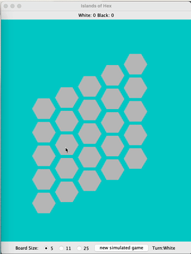
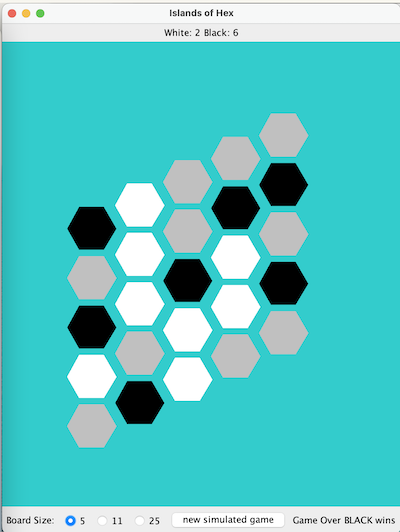

# Assignment: Islands Of Hex

In this assignment you'll construct the backend for a game played on a grid style board - the grid is composed of hexagon shaped tiles. The game is simple it's a two player game with one player playing white game pieces and the other playing black game pieces. The goal for the game is to have the most islands on the game board when the game finishes. The game ends when either black bisects the board with a continuous chain of game pieces from left to right or white bisects the board with a continuous chain of game pieces from top to bottom.




An island is a connected group of similarly colored game pieces that are surrounded by either empty tiles or tiles occupied by the opposite color. Connections are determined by hexagons that share a border.

In the below example there are 2 white islands and 6 black islands (the gray squares are empty). In this case the white tiles have formed a path from the top of the board to the bottom and therefore the game is over. Since the game is over the black player has won the game 6-2 (note that ties are possible in this version of the game).



Your job is to write the backend for this game. You will be responsible for the following functionality:

- determining if a play into a specific row and column is valid
- playing a piece into a specific row, column
- determining the score for white and black
- determining if the game is over

You are given a front-end graphical user interface that allows you to visualize the game. Your back-end code should work with this front-end but also pass a number of provided unit-tests.

The front-end and unit-tests are dependent on you completing the methods inside the `islands.backend.GameModel.java` class. In completing that class you may also want to add additional classes and methods (and are encouraged to do so).

See below the `GameModel` class that you must complete:

```java
package islands.backend;

/**
 * Class to model the play of the game
 *
 */
public class GameModel {

    public static final boolean WHITE = true;
    public static final boolean BLACK = false;

    /**
     * Construct a game with given sizexsize and an empty game board
     * @param sz the square size of the board
     */
    public GameModel(int sz) {

    }

    /**
     * Can a play be made at position row, col
     * @param row the row in question
     * @param col the col in question
     * @return true if row, col is empty, false o.w.
     * @throws IllegalArgumentException for invalid row and col
     */
    public boolean canPlay(int row, int col) {
        return true;
    }

    /**
     * play a piece and report if the game is over (true) false, otherwise
     * @param row the row where a piece is played
     * @param col the col where a piece is played
     * @param clr true for WHITE and false for BLACK
     * @return true if the game is over and false otherwise
     * @throws IllegalArgumentException for invalid row and col
     */
    public boolean makePlay(int row, int col, boolean clr) {
        return false;
    }

    /**
     * Return the score for white
     * @return white score
     */
    public int whiteScore() {
        return 0;
    }

    /**
     * return the score for black
     * @return black score
     */
    public int blackScore() {
        return 0;
    }
}

```

There are 3 different game play scenarios

- 5 x 5 quick play board
- 11 x 11 traditional play board
- 25 x 25 big game board

(although the unit-tests also include a larger game board (2500x2500) which may test your algorithm choice)

The game may be played with two players, or a game may be simulated with (non-intelligent) random computer players against each other.

There is an extensive set of unit-tests to ensure your solution is both accurate and efficient.

Deliverables:

There are two deliverables associated with this assignment.


1.  Jan 30, 2023 @ 10:00am

You must check in code that passes the FirstDeliverable unit-tests

You can run the FirstDeliverableTests with the following gradle command:
gradle test --tests *FirstDeliverableTests

Note that the first deliverable is associated with the canPlay method. There is no scoring nor determining if that game is over or not. You can mostly acachieve the first deliverable by creating a model to track where game pieces are played and reporting if a hex tile is already in use or not.

Grading: /2points

Grading to be completed by Github Autograding. Each time you push code to your repository the testcases will be run. Your code must be passing the basic tests by the above due date to receive full marks for part 1.


2. Feb 6, 2023 10:00am

Your completed assignment should be checked into the repository including determining when the game is over and tracking the score with each play.

Grading:
 - **FirstDeliverable Passes by 1st due date:** X / 2pt
 - **Functionality:** All unit tests pass and game plays appropriately x/4pts
 - **Code Readability:** appropriate method and variable names, spacing and indentation, comments above all methods, consistency of naming conventions and styles, self-documenting code over excessive commenting, etc x/2pt
 - **Code design:** no inappropriate class instance variables, the algorithms and data structures are implemented separate of the game as much as possible and easily maintained x/2pts


Note: The last unit-test involves a large game board (2500x2500), the timing of this test may be adjusted by the graders to account for the speed of their machine. For reference my solution runs in under 300ms on a modern laptop.
 
